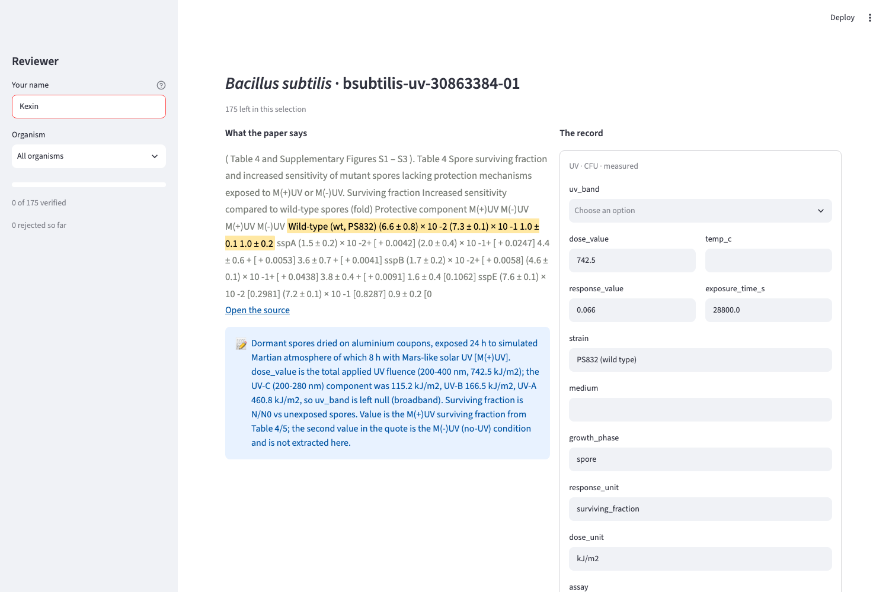
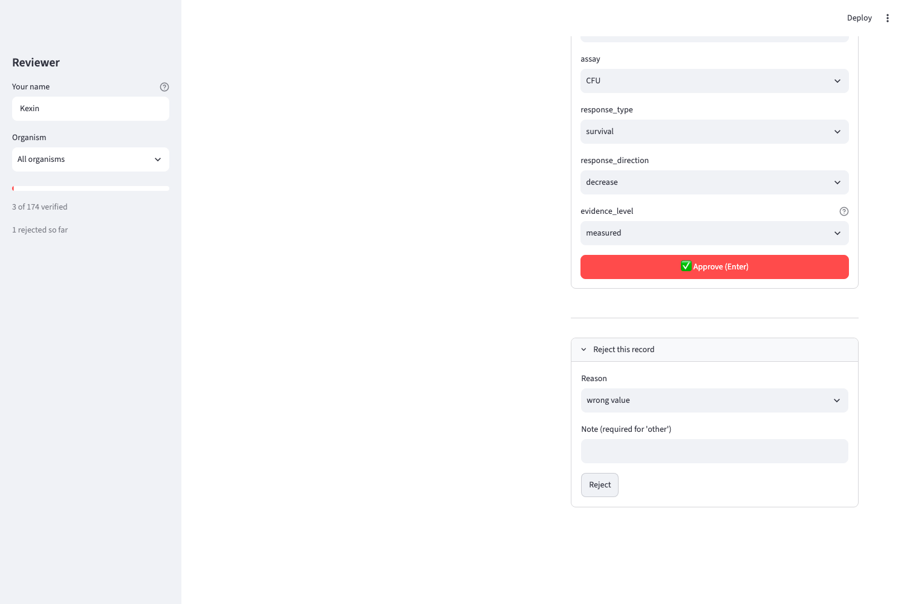

# Curator quickstart

You verify machine-extracted records against the paper. Nothing is released
until you sign off, and the person who extracted a record is never the person
who verifies it.

## Run it

```bash
make review          # opens http://localhost:8501
```

Type your name in the sidebar once. It is stamped on everything you approve.



## The 30-second loop

1. **Read the highlighted sentence on the left.** That is the exact text the
   extractor took the numbers from, shown inside the paper's own wording.
2. **Check the numbers on the right against it.** Value, unit, strain, assay.
3. **Approve** (or press Enter), **fix the fields then approve**, or **reject**.

## When to reject rather than fix

| Reason | Use it when |
|---|---|
| wrong value | the number is not what the sentence says |
| control-vs-treatment mixup | the record describes the untreated control |
| wrong strain | strain does not match the one the sentence is about |
| speculation marked as measured | the claim comes from Discussion, not Results |
| unit error | the unit is wrong in a way that changes the meaning |
| other | anything else — a note is required |

Fix small things (a missing medium, a typo in a strain name). Reject when the
record is about the wrong thing — rejections are the feedback that improves the
extraction prompt, so a reject is more useful than a heavy edit.



## Things worth knowing

- **Every action saves immediately.** Close the tab whenever; your progress and
  the sidebar counter survive a restart.
- **Enter approves.** Pressing Enter in any field submits the form, so do not
  hit it until you have actually read the record.
- **"Full text not cached on this machine"** means only that the paper was not
  downloaded here — follow the source link and check the quote yourself. It is
  not a sign the record is wrong.
- **"Quote not found in the cached full text"** is worth a real look. Usually
  it is a typography difference; occasionally the sentence is not in the paper,
  and then it must be rejected.
- **You cannot save a record that breaks the schema.** If an edit is refused,
  the message says what is wrong and nothing is written.

## Calibration session

Before solo reviewing starts, the whole team reviews the same 20 records
together and writes the disagreements down as rules below. Keep this list
short and concrete.

### Agreed rules

_(fill in during the calibration meeting — one line per resolved disagreement)_
